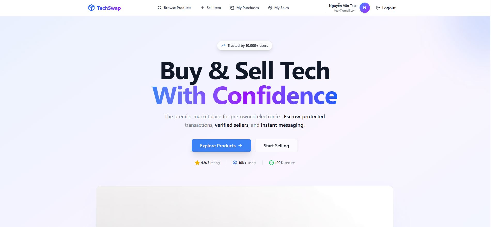
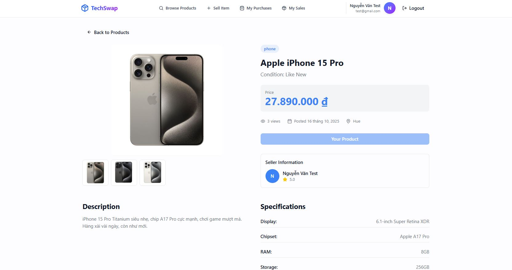
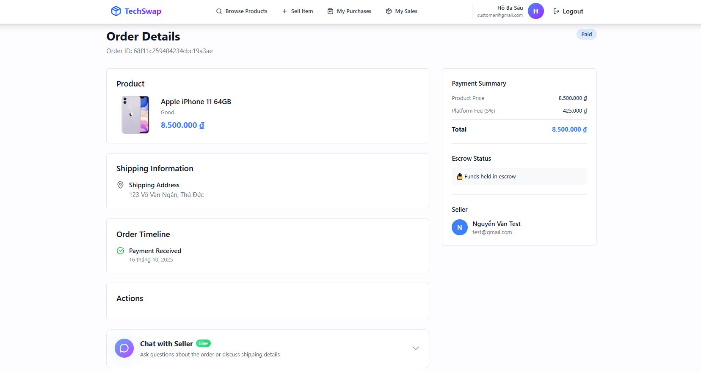
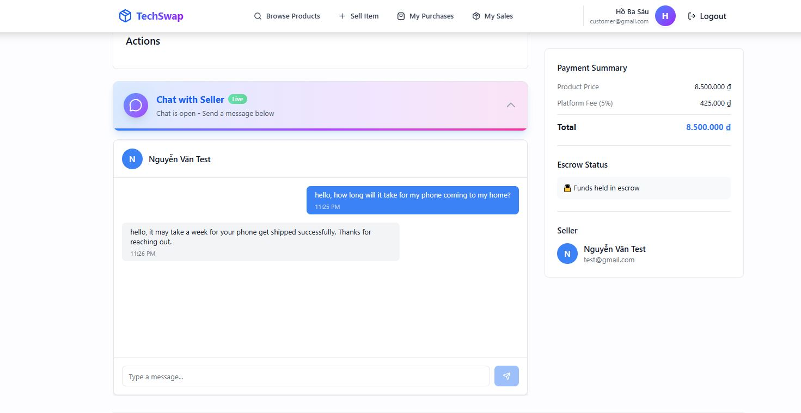

# 🚀 TechSwap - Secondhand Electronics Marketplace

> A full-stack marketplace platform for buying and selling secondhand electronics with secure escrow payments and real-time chat.

**🔗 Live Demo:** [https://techswap-black.vercel.app](https://techswap-black.vercel.app)

[](https://www.typescriptlang.org/)
[](https://reactjs.org/)
[](https://nodejs.org/)
[](https://www.mongodb.com/)

---

## ✨ Features

### 🛒 For Buyers & Sellers
- **Browse & Search** - Filter by category, condition, price range, and keywords
- **Product Listings** - Create listings with 3-8 images, detailed specs, and descriptions
- **Secure Payments** - PayOS payment gateway with escrow protection (in development)
- **Order Tracking** - Full transparency from purchase to delivery
- **Real-time Chat** - Instant messaging between buyers and sellers via Socket.io
- **Reviews & Ratings** - Build trust with post-transaction reviews

### 🔒 Security & Trust
- **Escrow System** - Money held securely until buyer confirms delivery
- **Auto-release** - Funds released to seller after 3 days if no disputes
- **Platform Fee** - 5% transaction fee, seller receives 95%
- **Secure Auth** - JWT authentication with bcrypt password hashing
- **Input Validation** - Zod schema validation for all user inputs

---

## 💻 Tech Stack

**Frontend:** React 18, TypeScript, Vite, Tailwind CSS, shadcn/ui, Zustand, TanStack Query

**Backend:** Node.js, Express, TypeScript, MongoDB, Mongoose

**Real-time:** Socket.io (chat & notifications)

**Payment:** PayOS Gateway integration

**Storage:** Cloudinary (image CDN)

**Deployment:** Vercel (frontend) + Render (backend) + MongoDB Atlas

---

## 🎯 How Escrow Works

```
1. 💰 Buyer pays via PayOS
   └─> Money held in escrow (not released to seller yet)

2. 📦 Seller ships product
   └─> Tracking number provided

3. ✅ Buyer confirms delivery
   └─> Escrow released
   └─> Seller receives 95% (platform keeps 5%)

⏰ Auto-release: If buyer doesn't respond within 3 days, 
   money is automatically released to seller
```

---

## 🚀 Quick Start

### Prerequisites
```bash
Node.js 18+
MongoDB (Atlas or local)
Cloudinary account
```

### Installation

```bash
# Clone the repository
git clone https://github.com/htp2003/techswap.git
cd techswap

# Backend setup
cd backend
npm install
cp .env.example .env
# Edit .env with your credentials
npm run dev

# Frontend setup (new terminal)
cd frontend
npm install
cp .env.example .env
# Edit .env with backend URL
npm run dev
```

### Environment Variables

**Backend (.env)**
```bash
PORT=5000
MONGODB_URI=your_mongodb_connection_string
JWT_SECRET=your_jwt_secret_key
CLOUDINARY_CLOUD_NAME=your_cloud_name
CLOUDINARY_API_KEY=your_api_key
CLOUDINARY_API_SECRET=your_api_secret
FRONTEND_URL=http://localhost:5173
```

**Frontend (.env)**
```bash
VITE_API_URL=http://localhost:5000/api
VITE_SOCKET_URL=http://localhost:5000
```

---

## 📁 Project Structure

```
techswap/
├── frontend/              # React + TypeScript + Vite
│   ├── src/
│   │   ├── components/   # Reusable UI components
│   │   ├── pages/        # Page components (Home, Products, Orders, etc.)
│   │   ├── services/     # API service calls
│   │   ├── store/        # Zustand state management
│   │   └── types/        # TypeScript type definitions
│   └── package.json
│
└── backend/              # Node.js + Express + TypeScript
    ├── src/
    │   ├── models/       # MongoDB models (User, Product, Order, etc.)
    │   ├── controllers/  # Route controllers
    │   ├── routes/       # API routes
    │   ├── middleware/   # Auth, validation, error handling
    │   ├── services/     # Business logic (payments, escrow, uploads)
    │   └── socket/       # Socket.io chat handlers
    └── package.json
```

---

## 🎨 Screenshots

### Home Page
*Browse secondhand electronics with advanced search and filters*



### Product Detail
*View detailed product specs, images, and seller information*



### Order Tracking
*Track your orders from payment to delivery*



### Real-time Chat
*Communicate instantly with buyers or sellers*



---

## 🔑 Key Features Explained

### Escrow Payment System
- Buyer's money is held securely by the platform
- Released only when buyer confirms receipt OR after 3-day auto-release
- Protects both buyers (can dispute) and sellers (guaranteed payment)

### Real-time Notifications
- Socket.io powered instant messaging
- Order status updates in real-time
- Typing indicators in chat

### Smart Search & Filters
- Full-text search across products
- Filter by category, condition, price range
- Sort by newest, price (low-high, high-low)
- Pagination for large datasets

---

## 🤖 AI Assistance

I used AI tools (e.g., GitHub Copilot/LLMs) to assist with coding and documentation. All code was reviewed, tested, and integrated by me; architectural decisions and overall direction remain my responsibility.

## 📝 License

MIT License

---

## 👤 Author

**Ha Tan Phat**
- GitHub: [@htp2003](https://github.com/htp2003)
- Email: hatanphat1121@gmail.com
- Portfolio: [View all projects](https://github.com/htp2003)


